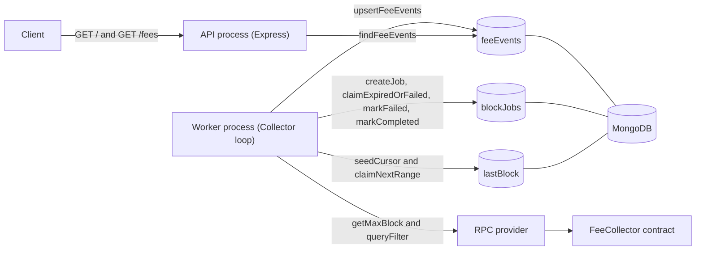
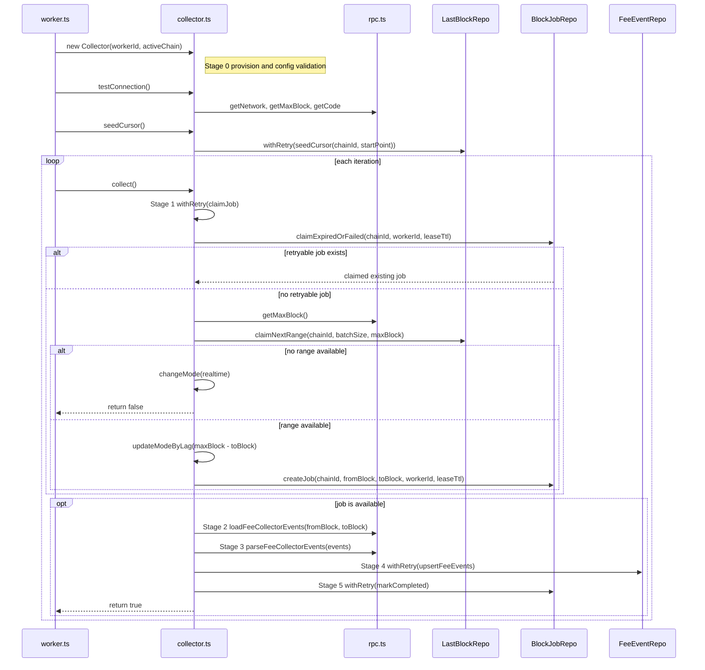

# lf-fee-collector architecture

## Purpose

`lf-fee-collector` indexes `FeesCollected` events from the LiFi FeeCollector contract and stores them in MongoDB.  
It runs two processes:

- `worker`: claims block ranges, fetches and parses events, and persists them.
- `api`: serves indexed events through HTTP (`GET /fees`) and health (`GET /`).

## System context

### Persistence model and invariants

- `lastBlock`: one cursor per `chainId`; atomically advances claimed ranges.
- `blockJobs`: lease-based processing jobs; retries failed/expired jobs; max attempts is 10.
- `feeEvents`: unique by `{transactionHash, logIndex}` for idempotent reprocessing.

## Worker boot and normal flow

1. `worker.ts` connects to MongoDB.
2. Constructs `Collector(workerId, activeChain)` (Stage 0).
3. Calls `testConnection()` (RPC chain + contract validation).
4. Calls `seedCursor()` once per chain.
5. Infinite loop:
   - call `collect()`,
   - if `false`, log idle/no work,
   - sleep based on mode (`historical` or `realtime`).

### Collect return semantics

- `collect() -> false`:
  - no range available (caught up), or
  - processing failed after a job was assigned and marked failed.
- `collect() -> true`:
  - a batch was processed successfully, or
  - an error happened before any job was assigned (logged, then next loop retries).

## Edge cases and branch behavior

```mermaid
flowchart TD
  workerStart["Worker starts"]
  cfgPresent{"RPC_URL, CONTRACT_ADDRESS, START_POINT present?"}
  cfgError["Throw: invalid chain config"]
  startPointNumeric{"START_POINT numeric?"}
  startPointError["Throw: START_POINT must be a number"]
  rpcCheck["testConnection"]
  chainMatch{"RPC chain id matches active chain?"}
  chainError["Throw: wrong RPC chain id"]
  contractExists{"Contract bytecode exists at CONTRACT_ADDRESS?"}
  contractError["Throw: no contract deployed"]
  loopStart["collect loop iteration"]
  claimRetry["claimExpiredOrFailed"]
  maxAttemptRule["attempts must stay below 10"]
  retryableJob{"Retryable job found?"}
  getMaxBlock["getMaxBlock"]
  claimRange["claimNextRange"]
  rangeAvailable{"Range available?"}
  goRealtime["changeMode(realtime)"]
  returnFalseIdle["Return false (idle)"]
  updateLag["updateModeByLag(maxBlock - toBlock)"]
  lagLow{"historical mode and lag <= batchSize?"}
  lagHigh{"realtime mode and lag >= batchSize * 5?"}
  keepMode["Keep current mode"]
  setRealtime["Set mode to realtime"]
  setHistorical["Set mode to historical"]
  createJob["createJob"]
  stage2["Stage 2 loadFeeCollectorEvents"]
  stage3["Stage 3 parseFeeCollectorEvents"]
  stage4["Stage 4 withRetry(upsertFeeEvents)"]
  stage5["Stage 5 withRetry(markCompleted)"]
  upsertNoop{"Empty events or duplicate event keys?"}
  upsertValid["upsertedCount can be 0 and is valid"]
  returnTrue["Return true"]
  stageError["catch(err)"]
  hasJob{"Job assigned already?"}
  failAndRetry["withRetry(markFailed) then return false"]
  markFailedOk{"markFailed succeeded?"}
  logOnly["Log error and continue"]
  returnTrueNoJob["Return true (no claimed job)"]
  returnFalseFailed["Return false"]
  fatalExit["Error bubbles to worker main catch and exit 1"]
  lifecycleSignal{"Signal or process-level error?"}
  gracefulStop["SIGINT or SIGTERM -> disconnectDB -> exit 0"]
  processCrash["uncaughtException or unhandledRejection -> disconnectDB -> exit 1"]

  workerStart --> cfgPresent
  cfgPresent -->|"no"| cfgError
  cfgPresent -->|"yes"| startPointNumeric
  startPointNumeric -->|"no"| startPointError
  startPointNumeric -->|"yes"| rpcCheck
  rpcCheck --> chainMatch
  chainMatch -->|"no"| chainError
  chainMatch -->|"yes"| contractExists
  contractExists -->|"no"| contractError
  contractExists -->|"yes"| loopStart

  loopStart --> claimRetry
  claimRetry --> maxAttemptRule
  maxAttemptRule --> retryableJob
  retryableJob -->|"yes"| stage2
  retryableJob -->|"no"| getMaxBlock
  getMaxBlock --> claimRange
  claimRange --> rangeAvailable
  rangeAvailable -->|"no"| goRealtime
  goRealtime --> returnFalseIdle
  rangeAvailable -->|"yes"| updateLag
  updateLag --> lagLow
  lagLow -->|"yes"| setRealtime
  lagLow -->|"no"| lagHigh
  lagHigh -->|"yes"| setHistorical
  lagHigh -->|"no"| keepMode
  setRealtime --> createJob
  setHistorical --> createJob
  keepMode --> createJob
  createJob --> stage2

  stage2 --> stage3
  stage3 --> stage4
  stage4 --> upsertNoop
  upsertNoop -->|"yes"| upsertValid
  upsertNoop -->|"no"| stage5
  upsertValid --> stage5
  stage5 --> returnTrue

  claimRetry -->|"throws"| stageError
  getMaxBlock -->|"throws"| stageError
  claimRange -->|"throws"| stageError
  createJob -->|"throws"| stageError
  stage2 -->|"throws"| stageError
  stage3 -->|"throws"| stageError
  stage4 -->|"throws"| stageError
  stage5 -->|"throws"| stageError
  stageError --> hasJob
  hasJob -->|"yes"| failAndRetry
  hasJob -->|"no"| logOnly
  logOnly --> returnTrueNoJob
  failAndRetry --> markFailedOk
  markFailedOk -->|"yes"| returnFalseFailed
  markFailedOk -->|"no"| fatalExit

  workerStart --> lifecycleSignal
  lifecycleSignal -->|"SIGINT or SIGTERM"| gracefulStop
  lifecycleSignal -->|"uncaughtException or unhandledRejection"| processCrash
```

### Edge-case checklist

- Constructor fails fast when `RPC_URL`, `CONTRACT_ADDRESS`, or `START_POINT` is missing.
- Constructor fails when `START_POINT` is not numeric.
- `testConnection` fails when RPC chain id mismatches or contract bytecode is missing.
- Stage 1 prioritizes retrying failed/expired jobs (`attempts < 10`) before claiming new ranges.
- Database writes and job state transitions use `withRetry` (default 3 attempts, linear backoff, DB health check and reconnect before retries).
- If cursor is caught up (`claimNextRange` returns `null`), mode switches to `realtime` and worker idles.
- Mode switching logic:
  - historical -> realtime when lag is at or below `BATCH_SIZE`,
  - realtime -> historical when lag is at or above `BATCH_SIZE * 5`.
- Empty event batch is valid (`upsertFeeEvents` returns `0`).
- Duplicate events are safe due to unique `{transactionHash, logIndex}` upsert key.
- On stage failure after claiming a job: job is marked failed and loop continues.
- On failure before job assignment: error is logged and `collect()` returns `true` (next iteration retries).
- If retry wrappers exhaust attempts, error bubbles to worker main catch and process exits with code `1`.
- Worker exits cleanly with code `0` for `SIGINT`/`SIGTERM`.
- Startup failure, `uncaughtException`, and `unhandledRejection` all end with `disconnectDB` and exit code `1`.

## API request path

- `GET /` returns `200` with `Api Running`.
- `GET /fees`:
  - query param `integrator` is treated as chain id (defaults to `137`),
  - rejects non-numeric chain id with `400`,
  - clamps pagination (`page >= 1`, `1 <= limit <= 100`),
  - returns `{ data, pagination }` where data is sorted by block desc then log index desc.
- Any API handler exception returns `500`.

## Configuration reference

| Variable | Required | Default | Effect |
| --- | --- | --- | --- |
| `APP_ENV` | no | `development` | Controls dev/prod startup behavior in Docker script. |
| `API_PORT` | no | `9999` | API listen port. |
| `LOG_LEVEL` | no | `debug` | Logger verbosity. |
| `MONGO_URI` | no | `mongodb://localhost:27017/lf-fee-collector` | Mongo connection target. |
| `ACTIVE_CHAIN` | effectively yes | none | Chain id passed to Collector/RPC validation. |
| `RPC_URL` | yes | none | RPC endpoint used by `Rpc`. |
| `CONTRACT_ADDRESS` | yes | none | FeeCollector contract address. |
| `START_POINT` | yes | none | Initial block cursor for first run. |
| `BATCH_SIZE` | no | `100` | Claimed range size per job. |
| `JOB_LEASE_TTL_MS` | no | `120000` | Lease duration before processing jobs are retryable. |
| `HISTORICAL_POLL_INTERVAL_MS` | no | `5000` | Sleep interval in historical mode. |
| `REALTIME_POLL_INTERVAL_MS` | no | `60000` | Sleep interval in realtime mode. |
| `DEV_MULTIPLE_WORKERS` | no | `false` | In local Docker dev, can run two worker processes. |

## Notes on concurrency and safety

- `lastBlock.claimNextRange` uses atomic cursor updates to avoid overlapping range claims.
- `blockJobs` has unique index on `{chainId, fromBlock}` and lease-based retry claim logic.
- Event persistence is idempotent, so replaying the same range does not duplicate stored events.
